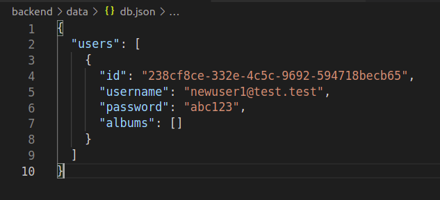

# Updating our project - adding "registration" functionality

Now we want to make our project a bit more "interesting", as well as practicing using lowdb, express.Router and controller functions. 

To do this, we will start to restructure our app so that **users have to register or login** to (1) see their personal list of albums and (2) add a new album.

We will start this restructuring now, by implementing a **"registration" route** to allow a user to register. The rest of the functionality (e.g. logging in, adding a new album after logging in) will come soon!

We will also update our frontend shortly - **for now, we can use Postman** to test whether our new route is working. :-)

---

## Instructions

---

### Part 1 - Restructuring the data

- Update your db.json file in the following ways:
  - If you have any albums already added, you should delete them from the file.
  - You should also change the data structure. Instead of only holding a list of albums, like this:

```json
{
  "albums": []
}
```

The database should instead hold a list of users.

```json
{
  "users": []
}
```

---

### Part 2 - Creating a new "register" router

- Add a file called `register.js` to your `routes` directory.
- Create an express router in the new file and make it a default export.
- In `index.js`, register your router for the endpoint `/register` (using `app.use()`).
- Back in `register.js`, create one new POST route for the `/` path (i.e. for POST requests sent by the frontend to `/register`).
- Leave this route for now - at the moment, it will not have a handler function to call when it receives a request. We will change this later. :-)

---

### Part 3 - Creating a new POST "/register" controller function

- Now you will create a controller function to call for your new `/register` POST route. This route will handle the registration of a new user.
- In your `controllers` directory, add another file called `registerController.js`.
- In this file, create a new function called `registerPost` which takes the `request` object and `response` object as parameters.
- Your function should have the following logic:
    - The `body` of the `request` object should be an object with two properties: `username` and `password`.
    - The function should create a new object called `newUser`. The object should have four properties:
        - `id` (initialize with `uuid`)
        - `username` (initialize with the `username` property from the body of the `request` object)
        - `password` (initialize with the `password` property from the body of the `request` object)
        - `albums` (initialize with an empty array)
- Once you have created the `newUser` object, you should update the `users` property of lowdb's `db.data` to include the new user. You should then also update the `db.json` file itself (do you remember the asynchronous method which can do this)?
- Once this is all done, you should send a `response` containing the new user object (remember: this should have 4 properties) in JSON format.
- Finally, don't forget to export your `registerPost` controller function, and import it into your `register.js` router. This will be the function called when a request is received to the `/register` POST route.

---

### Testing your changes

**You can test your new route using Postman**. For example, if you use Postman to send a POST request to the `/register` endpoint with the following data in its `body`:

```json
{
    "username": "newuser1@test.test",
    "password": "abc123"
}
```

You should receive the following object back in your server's `response`:

```json
{
    "id": /*A 32-character uuid string*/,
    "username": "newuser1@test.test",
    "password": "abc123",
    "albums": []
}
```

Ideally, your response will also send a `201` status code, as you just created a new "resource" (the object containing the new user's details) in your database file. See if you can remember how to do this!

Finally, you should also check the `db.json` file in your backend repo. This should also contain the above object, proving that you also updated your database file with the new user's details:



---

### Next steps...

Note that there is no error handling yet (e.g. if the same user is added twice). That will come later this week! 

Tomorrow we will look at updating the app to allow each user of our app to log in and add their own albums. :-)